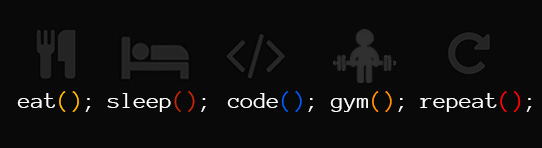

[]   
# Hi, I'm SaPradilla
 

      

[][1]

I am **Full-Stack | Software Engineer | Cloud Enthusiast** from India :india:.

I am interested in develop (open source) software solutions using JavaScript, TypeScript, NodeJS and Golang.

